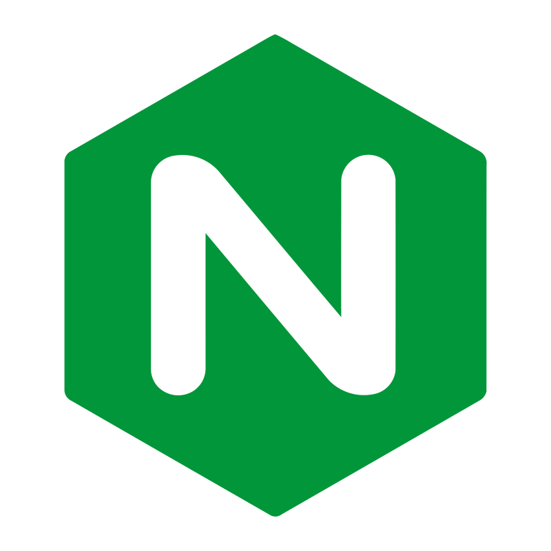
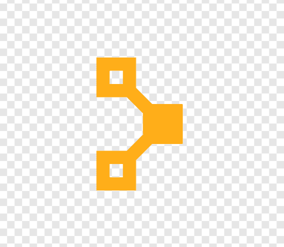

### Greetings

<!--
**KenNyagz/Kennyagz** is a ✨ _special_ ✨ repository because its `README.md` (this file) appears on your GitHub profile.

Here are some ideas to get you started:

- 🔭 I’m currently working on ...
- 🌱 I’m currently learning ...
- 👯 I’m looking to collaborate on ...
- 🤔 I’m looking for help with ...
- 💬 Ask me about ...
- 📫 kennyagz681@gmail.com
- 😄 Pronouns: ...
- ⚡ Fun fact: ...
-->
📫 kennyagz681@gmail.com

## Techonologies I am comfortable with...

<code></code>
<code></code>
<code></code>
<code></code>
<code></code>
<code></code>
<code></code>
<code></code>
<code></code>
<code></code>
<code></code>
<code></code>
<code></code>
<code></code>
<code></code>
<code></code>
<code></code>
<code></code>
<code></code>
<code></code>
<!--
<code></code>
<code></code>
<code></code>
<code></code>
<code></code>
-->

