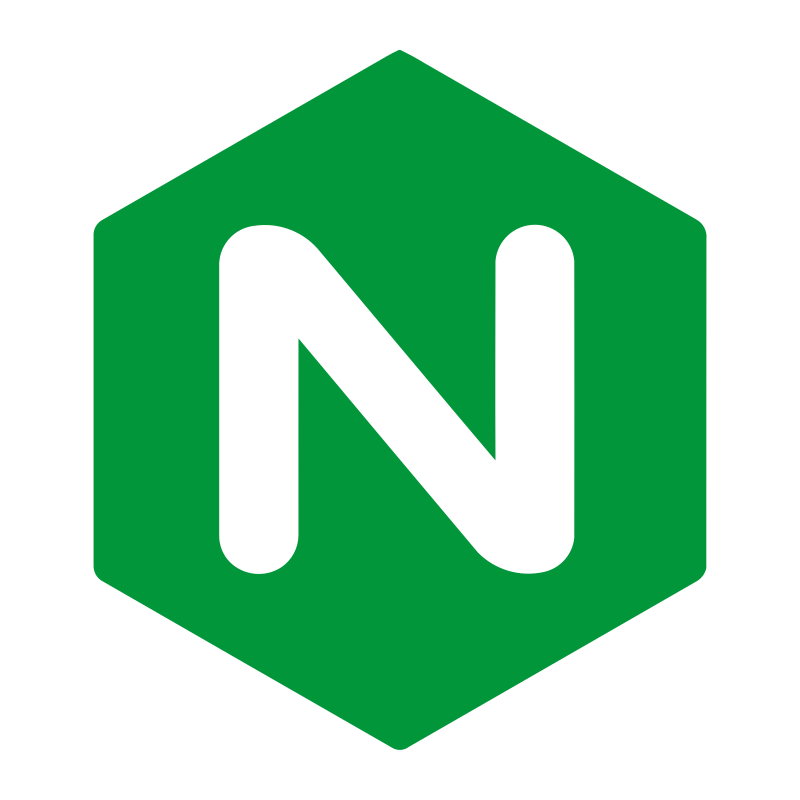
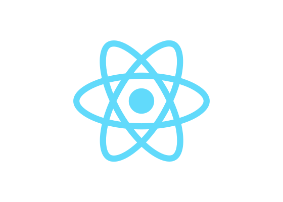
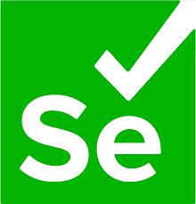

### Greetings

<!--
**KenNyagz/Kennyagz** is a ✨ _special_ ✨ repository because its `README.md` (this file) appears on your GitHub profile.

Here are some ideas to get you started:

- 🔭 I’m currently working on ...
- 🌱 I’m currently learning ...
- 👯 I’m looking to collaborate on ...
- 🤔 I’m looking for help with ...
- 💬 Ask me about ...
- 😄 Pronouns: ...
- ⚡ Fun fact: ...
-->
My name is Kenneth.

A passionate software engineer with a deep appreciation for engineering in all its forms. 
I specialize in backend development and cloud solutions, building scalable and reliable systems.

## Here are some of the technologies I am comfortable with...

<code></code>
<code></code>
<code></code>
<code></code>
<code></code>
<code></code>
<code></code>
<code></code>
<code></code>
<code></code>
<code></code>
<code></code>
<code></code>
<code></code>
<code></code>
<code></code>
<code></code>
<code></code>
<code></code>
<code></code>
<code></code>
<code></code>
<code></code>
<code></code>

<!--
<code></code>
<code></code>
<code></code>
<code></code>
<code></code>
<code></code>
-->
<!--
<code></code>
-->

You can reach me via:
📫 kennyagz681@gmail.com

<code></code> <code></code> <code></code> <code></code>
